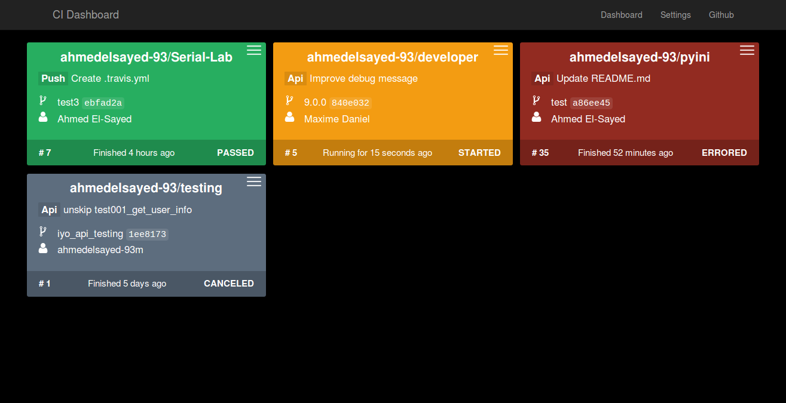

# CI Dashboard
Travis CI builds dashboard written in python



### Installation

#### Quick start
```bash
git clone https://github.com/ahmedelsayed-93/ci-dashboard
cd ci-dashboard
python3 main.py --host ${host} --port ${port} 
```
#### Full installation
```bash
sudo curl -sL https://raw.github.com/ahmedelsayed-93/ci-dashboard/master/install.sh | bash -s {{branch}} {{path}}
default branch: master , path: /opt
```
### How to use
#### Help
```bash
cidashboard help

CI-Dashboard help
    Options:
    start :        start the server.
        options:
        --host : the hostname to listen on, default 127.0.0.1
        --port : the port of the webserver, default 5000
    stop   :    stop the server.
    update :    update software.
```

#### Start
```bash
cidashboard start --host {{host}} --port {{port}}
```
CI-Dashboard server will be started in new tmux session named [cidashboard].
- Go to settings page **(http:/{host}:{port}/settings)**, and set your configrations.
- Go to Dashboard page **(http:/{host}:{port}/dashboard)**, and have fun!.

#### Stop
```bash
cidashboard stop
```
#### Update
```bash
cidashboard update 
```

### Configuration
To set configrations using the portal go to **http://{host}:{port}/settings**

or you can set it manualy by editing **ci-dashboard / config.json** file as follow
```json
{
  "repos": [
    "ahmedelsayed-93/pyini",
    "ahmedelsayed-93/ci-dashboard",
  ],
  "token": "travis token",
  "github_token": "github token",
  "threads": 10
  "columns": 3,
  "interval": 10000
}
```
```repos``` : list of repositories to be shown on the dashboard.

```token``` : travis api token.

```github_token```: github api token (optional)

```threads```: number of thread which used to collect dashboard info 

```columns```: how many cloumns in the dashboard.

```interval``` : update interval in miliseconds

### To do
- handling errors

### Author 
[Ahmed El-Sayed](mailto:ahmed.m.elsayed-93@gmail.com) 
